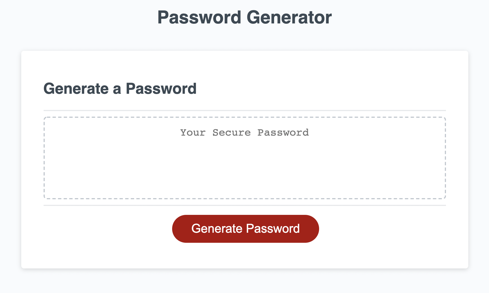

# Passwords-for-Dayzzz

Week 3 Homework for OSU Bootcamp

## Description

This webpage uses DOM munipulation to generate random passwords based on criteria selected by the user.  The criteria is selected using a series of prompts and confirms after the "Generate Password" button has been clicked.

Check it out here https://youngin9210.github.io/Passwords-for-Dayzzz/

## Table of Contents

* [Screenshots](#screenshots)
* [Installation](#installation)
* [Credits](#credits)
* [License](#license)
* [Badges](#badges)

## Screenshots

## Installation

Using the terminal, clone the repository to your local device using SSH or HTTPS.  Once cloned, open repository in a text editor to make changes.

## Credits

Kyle Young https://github.com/Youngin9210

## License

## Badges

